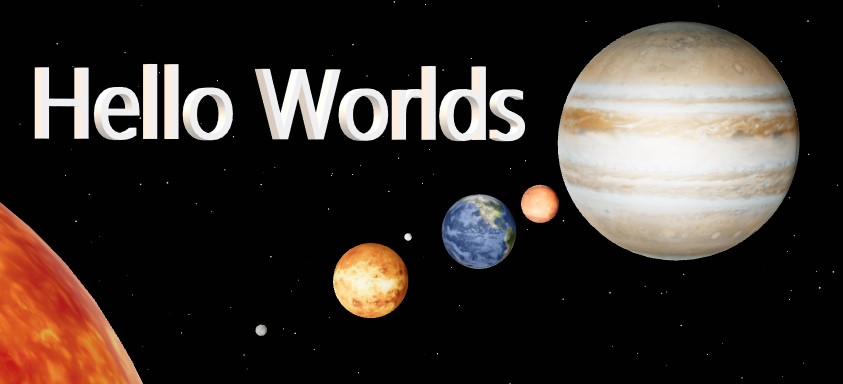

<div style="display: flex; justify-content: left;">

</div>

____


## Description

Hello Worlds is a 3D modal of the solar system built with three.js, React-three-fiber, and Drei.

## Table of Contents
* [Links](#links)
* [Animation](#animation)
* [Installation](#installations) 
* [Tests](#tests)
* [Dependencies](#dependencies)  
* [Contribute](#contribute) 
* [License](#license)
* [Contact](#contact)

## Links
Published URL: [https://commit-nutrition.herokuapp.com/](https://commit-nutrition.herokuapp.com/)

Repository: [https://github.com/spencercreer/meal-planner](https://github.com/spencercreer/meal-planner)

## Animation
The following animation demonstrates the application functionality:<br>


## Installation
This application utilizes the following [dependencies](#dependencies).

After cloning the repo, install the necessary dependencies by running the following command:
  ```
  npm install
  ```
Once your local database is setup, you may start the application by running:
  ```
  npm start
  ```

## Tests
Tests are written using Jest. To run tests, start the server and run the following command:

  ```
  npm test
  ```
## Dependencies

This application utilizes the following dependencies:

|Dependency           |Version    |
|---------------------|-----------|
|express              |0.0.0      |

The following dev dependencies are also included:

|devDependency        |Version    |
|---------------------|-----------|
|nodemon              |0.0.0      |

## Contribute
Please submit a PR if you would like to contribute

## License
This project is licensed under the MIT license.

## Contact
For questions or comments, please contact me.

Email: <a href="mailto: spencercreer@gmail.com" target="_blank">spencercreer@gmail.com</a>

GitHub: [spencercreer](https://github.com/spencercreer/)
